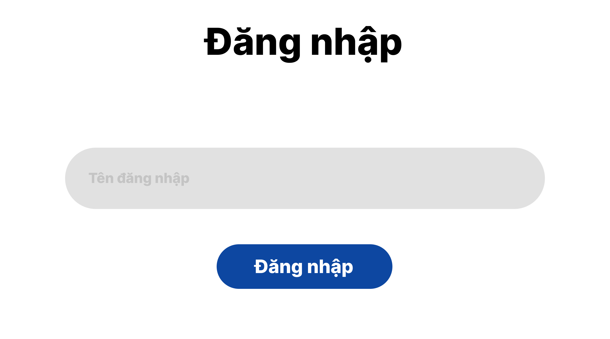
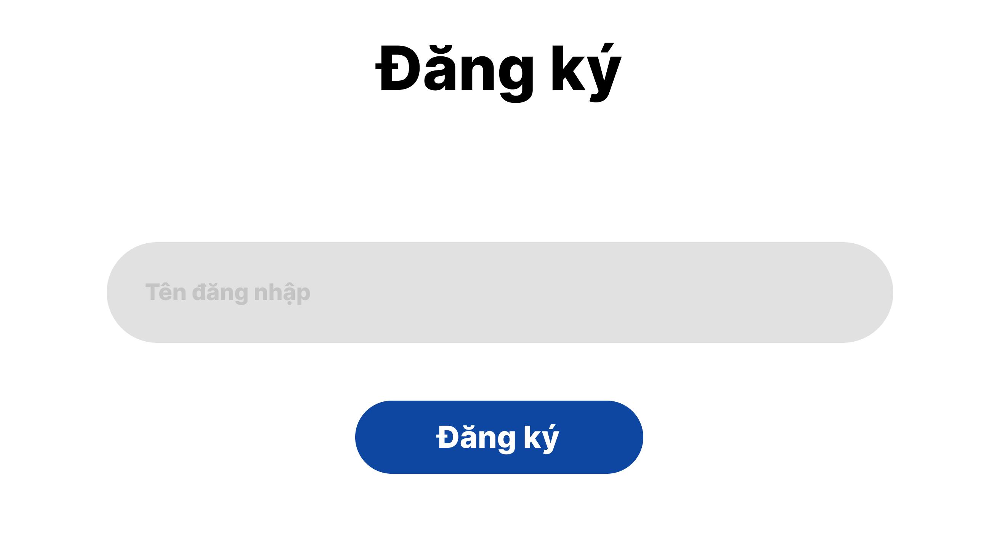
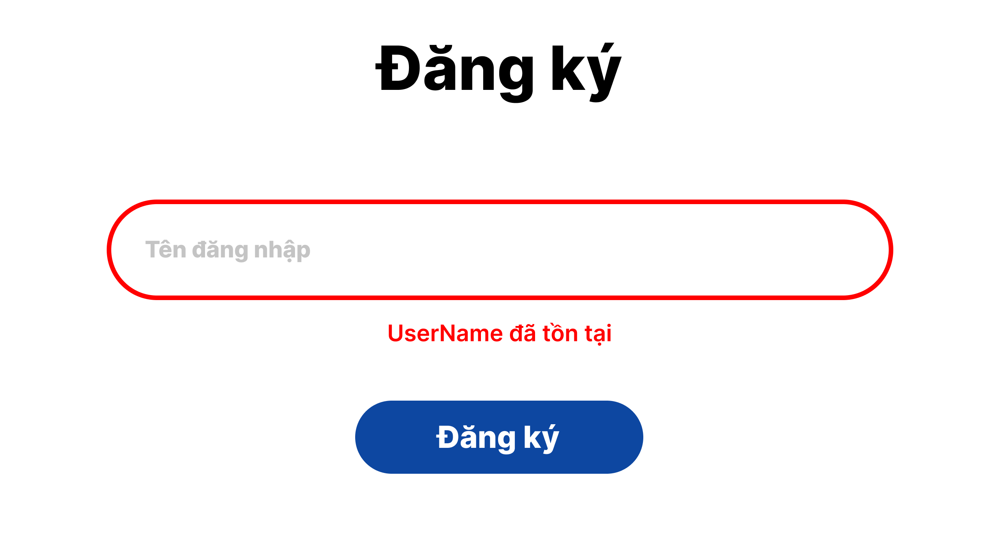
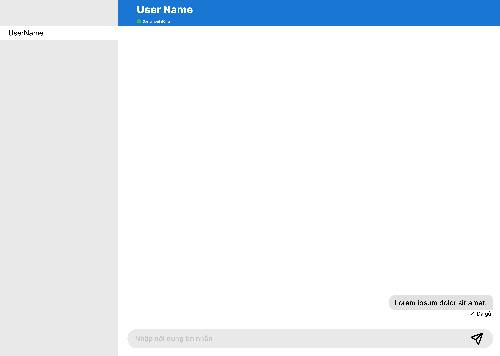

<h2 align="center">
    <a href="https://dainam.edu.vn/vi/khoa-cong-nghe-thong-tin">
    🎓 Faculty of Information Technology (DaiNam University)
    </a>
</h2>
<h2 align="center">
   Ứng dụng chat Client-Server sử dụng TCP
</h2>
<div align="center">
    <p align="center">
        
        
        
    </p>

[](https://www.facebook.com/DNUAIoTLab)
[](https://dainam.edu.vn/vi/khoa-cong-nghe-thong-tin)
[](https://dainam.edu.vn)

</div>

## 📖 1. Giới thiệu

Đề tài "Ứng dụng chat Client-Server sử dụng TCP" tập trung vào việc xây dựng một hệ thống truyền tin cơ bản dựa trên mô hình mạng Client-Server. Mục tiêu chính của đề tài là ứng dụng các kiến thức về lập trình mạng, đặc biệt là việc sử dụng giao thức TCP (Transmission Control Protocol) để đảm bảo một kết nối đáng tin cậy và có thứ tự. Ứng dụng này sẽ bao gồm hai thành phần chính: Server (Máy chủ) đóng vai trò quản lý kết nối và chuyển tiếp tin nhắn, và Client (Máy khách) cho phép người dùng kết nối, gửi và nhận tin nhắn theo thời gian thực.

Thông qua việc triển khai đề tài này, người học sẽ có cơ hội thực hành các kỹ năng quan trọng như: tạo socket, xử lý đa luồng (multi-threading) để phục vụ nhiều client cùng lúc, và xử lý luồng dữ liệu (I/O streams) để truyền nhận thông tin qua mạng. Sản phẩm hoàn thiện không chỉ là một ứng dụng chat đơn thuần mà còn là minh chứng rõ ràng cho việc nắm vững các nguyên lý cơ bản của lập trình socket trong môi trường mạng, đặt nền tảng vững chắc cho các dự án phức tạp hơn trong tương lai.

## 🔧 2. Ngôn ngữ lập trình sử dụng:

[](https://www.java.com/) [](https://www.mongodb.com/)

Java: Ngôn ngữ lập trình chính được dùng để xây dựng cả hai thành phần Client và Server. Java được chọn vì nó hỗ trợ mạnh mẽ cho lập trình mạng với các thư viện tích hợp sẵn như java.net.

Mô hình Client-Server: Đây là mô hình kiến trúc mạng cơ bản, trong đó máy chủ (Server) cung cấp dịch vụ và xử lý các yêu cầu từ máy khách (Client). Trong dự án này, Server có nhiệm vụ lắng nghe kết nối, quản lý các client, và chuyển tiếp tin nhắn, trong khi Client là giao diện để người dùng tương tác.

Giao thức TCP (Transmission Control Protocol): TCP là giao thức truyền tải đáng tin cậy, có định hướng kết nối. Nó đảm bảo các gói dữ liệu được gửi đi sẽ đến nơi mà không bị mất, trùng lặp hay sai thứ tự. Việc sử dụng TCP rất phù hợp cho một ứng dụng chat, nơi tính toàn vẹn và thứ tự của tin nhắn là yếu tố quan trọng.

## 3. Các chức năng trong ứng dụng.

- Hiện thị trạng thái hoạt động của user.
- Hiện thị trạng thái tin nhắn ( Đã xem, đã nhận).
- Đăng nhập, đăng ký vào hệ thống

## 📝 4. Hình ảnh chức năng.

<p align="center">
        
        Đăng nhập
    </p>

<p align="center">
        
        Đăng ký
    </p>
    
<p align="center">
        
        Thông báo lỗi đăng ký
</p>

<p align="center">
        
        Màn chi tiết tin nhắn
</p>

## 📋 5. Các bước cài đặt

### Bước 1: Cài đặt JDK (Java Development Kit)
- Tải JDK từ [Oracle JDK](https://www.oracle.com/java/technologies/downloads/) hoặc [OpenJDK](https://jdk.java.net/).
- Cài đặt và thiết lập biến môi trường:
  - **JAVA_HOME** = Đường dẫn đến JDK (ví dụ: `C:\Program Files\Java\jdk-21`)
  - Thêm `%JAVA_HOME%\bin` vào **Path**.
- Kiểm tra cài đặt thành công:
  ```bash
  java -version
  javac -version

### Bước 2: Cài đặt MongoDB
- Tải [MongoDB Community Server](https://www.mongodb.com/try/download/community) và cài đặt.

- Cài thêm [MongoDB Compass](https://www.mongodb.com/products/tools/compass) để quản lý dữ liệu trực quan.

- Kiểm tra cài đặt:
    ``` bash
    mongod --version
    mongo --version

### Bước 3: Chạy chương trình
- Biên dịch và chạy chương trình:
    ``` bash
    javac Main.java
    java Main 
